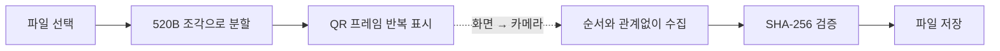

<div align="center">
  

  # QR Air

  **와이파이도, 블루투스도 없이. 파일을 빛으로 건네세요.**

  화면에 흐르는 QR 코드를 카메라로 읽어 파일을 전송하는 로컬 우선 웹앱입니다.

  
  
  
  
</div>

---

## QR Air는 무엇인가요?

QR Air는 파일을 작은 조각으로 나누고, 각 조각을 빠르게 바뀌는 QR 코드로 표시합니다. 받는 기기는 카메라로 QR을 읽어 조각을 모은 뒤 원본 파일을 복원합니다.

- 별도의 계정이나 페어링이 필요 없습니다.
- 전송할 파일을 서버에 업로드하지 않습니다.
- 조각을 순서대로 촬영하지 않아도 됩니다.
- 중간부터 촬영해도 다음 반복에서 빠진 조각을 받을 수 있습니다.
- 전체 파일의 SHA-256 해시를 검사해 손상 여부를 확인합니다.



## 사용 방법

### 보내는 기기

1. **보내기**에서 파일을 선택합니다.
2. 전송 속도를 2–12 FPS 범위에서 조절합니다.
3. 움직이는 QR 전체가 상대 카메라에 보이도록 화면을 고정합니다.

### 받는 기기

1. **받기**에서 카메라 사용을 허용합니다.
2. 송신 화면의 QR을 카메라 프레임 안에 맞춥니다.
3. 수신이 끝나면 **파일 저장**을 누릅니다.

> 손으로 들고 촬영할 때는 4–7 FPS, 두 기기를 고정했다면 8–12 FPS를 권장합니다.

## 로컬에서 실행하기

### 요구 사항

- Node.js 20.19 이상 또는 22.12 이상
- npm

```bash
git clone https://github.com/Gyu-BBB/qr-air.git
cd qr-air
npm install
npm run dev
```

컴퓨터 브라우저에서 터미널에 표시된 `http://localhost:5173` 주소를 여세요.

프로덕션 빌드:

```bash
npm run build
npm run preview
```

테스트:

```bash
npm test
```

## iPhone에서 사용하기

iPhone Safari는 카메라 API를 **보안 컨텍스트**에서만 허용합니다.

- `https://`로 배포된 주소: 카메라 사용 가능
- iPhone에서 접속한 `http://192.168.x.x`: 페이지는 열리지만 카메라 사용 불가
- 컴퓨터의 `http://localhost`: 해당 컴퓨터에서만 예외적으로 사용 가능

따라서 실제 iPhone 수신 테스트에는 HTTPS 배포가 필요합니다. 웹앱을 한 번 불러와 리소스가 캐시된 뒤에는 파일 전송 자체에 인터넷 연결이 필요하지 않습니다.

## 전송 프로토콜

각 QR은 독립적으로 해석할 수 있는 JSON 프레임을 담습니다.

| 필드 | 의미 |
|---|---|
| `p` | 프로토콜 버전 (`QRA1`) |
| `id` | 전송 세션 ID |
| `i` | 현재 조각 번호 |
| `t` | 전체 조각 수 |
| `s` | 원본 파일 크기 |
| `n` | 파일명 |
| `m` | MIME 타입 |
| `h` | 원본 파일 SHA-256 |
| `d` | Base64로 인코딩된 파일 조각 |

수신기는 세션 ID가 같은 프레임만 모아 조각 번호에 맞게 재배열합니다. 모든 조각이 모이면 파일을 합치고 SHA-256 해시를 비교한 후 저장 버튼을 활성화합니다.

## 기술 구성

- [Vite](https://vite.dev/) — 개발 서버 및 프로덕션 번들
- [qrcode](https://github.com/soldair/node-qrcode) — 송신 QR 생성
- [jsQR](https://github.com/cozmo/jsQR) — 카메라 프레임 디코딩
- Web APIs — `getUserMedia`, Web Crypto, Blob, Web Share
- Service Worker + Web App Manifest — 설치 및 오프라인 재사용

모든 전송 및 파일 복원 로직은 브라우저 안에서 실행됩니다. 별도 백엔드는 없습니다.

## 현재 제한 사항

- 프로토타입 단계에서는 20MB 이하 파일을 권장합니다.
- 전송 속도는 카메라 노출, 초점, 화면 밝기와 주사율에 영향을 받습니다.
- 현재는 Fountain Code 대신 누락 프레임을 반복 송출하는 방식을 사용합니다.
- QR을 볼 수 있는 주변 카메라도 내용을 촬영할 수 있으므로 민감한 파일은 공개된 장소에서 전송하지 마세요.
- SHA-256은 무결성을 확인하지만 데이터를 암호화하지는 않습니다.

## 로드맵

- [ ] Fountain/LT Code 기반 누락 복구
- [ ] 24–30 FPS 고속 모드
- [ ] 화면에 여러 QR을 표시하는 병렬 전송
- [ ] 선택적 종단 간 암호화
- [ ] 전송 속도 및 인식률 진단 화면
- [ ] HTTPS 정적 배포

## 프로젝트 구조

```text
qr-air/
├── public/              # PWA 매니페스트, 아이콘, 서비스 워커
├── src/
│   ├── main.js          # 송신·카메라 수신 UI와 상태 관리
│   ├── protocol.js      # 프레임 생성, 파싱, 파일 복원
│   └── style.css        # 반응형 인터페이스
├── test/
│   └── protocol.test.js # 프로토콜 단위 테스트
└── index.html
```

---

<div align="center">
  <strong>QR Air</strong><br />
  Local-first file transfer, carried by light.
</div>
